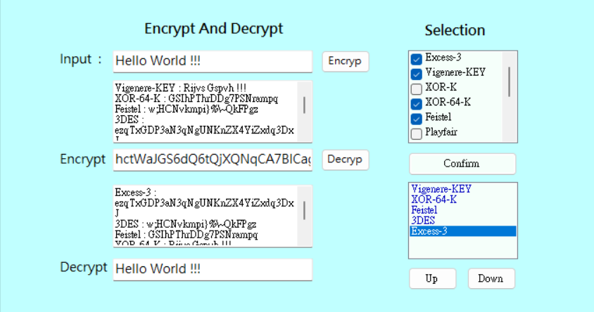

# Encrypt and Decrypt 
This is a final little project in algorithm course.  
Includes the use of various encryption methods and corresponding decryption methods.

## Algorithms
* Excess -3
* Vigenere
* XOR
* Feistel
* PlayFair
* DES
* 3DES
* 3DES-CBC
* AES
* RC2
* RSA

## Demo
