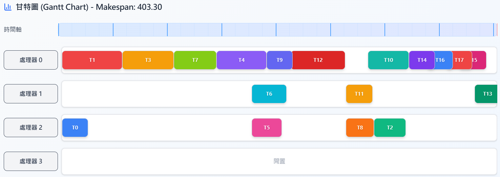

# Processor Scheduler

 

Processor Scheduler is a simulation project focused on solving  task matching and scheduling problems. It leverages both heuristic and optimization algorithms to intelligently search for near-optimal or optimal solutions.The project is designed to explore how intelligent algorithms can improve the efficiency of CPU task allocation and scheduling, which is a crucial topic in computer systems and operating system design.

This project was developed as part of the Evolutionary Computation course project at National Kaohsiung University of Science and Technology (NKUST). It serves as an academic experiment in applying techniques such as genetic algorithms, simulated annealing, and other metaheuristics to classical scheduling problems.

Visualization Tools used : https://acaihi.github.io/TSM-V/

#### Algorithm Implement and Experiment

* Simulated Annealing
* Genetic Algorithm [ 4 Types ]
* Tabu Search
* Kahn Algorithm
* Genetic Algorithm Mix Tabu Search
* Discrete Whale Optimization Algorithm
* Hybrid Meta-Heuristic Algoritms
