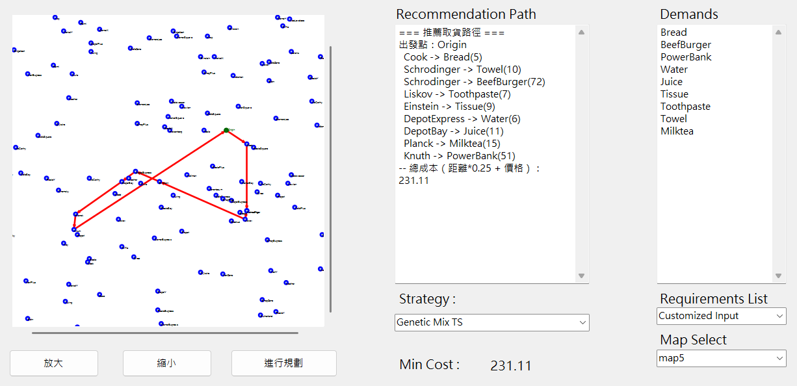
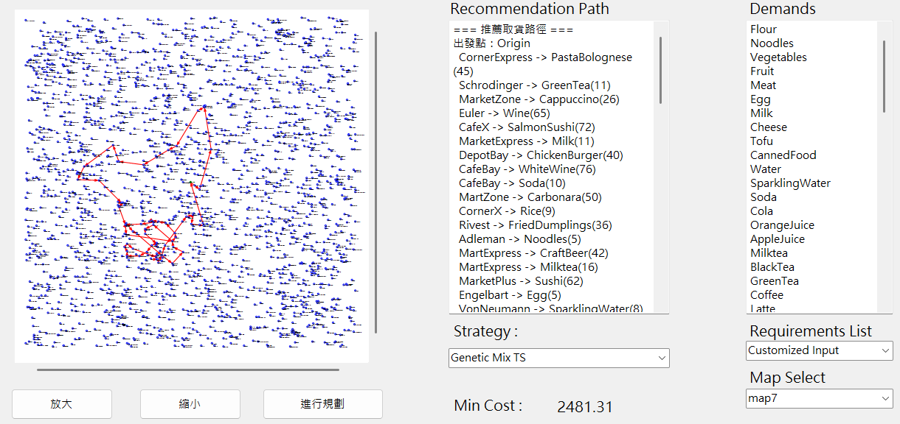

# Algorithms-Dungeon-Study-Notes

This is a collection of notes and practices on algorithms and heuristic optimization, covering common problem types, solution strategies, performance comparisons, and learning experiences.

This repository is my notes and practice in the process of learning algorithms, covering :

* Algorithm  : Notes and organization of algorithms
* Problems  :  Various classic problems and solutions
* Project  :  Some small practical projects and applications

Aims to deepen understanding and application through recording and practice.

 
 
 
 

# Algorithms

This section organizes various algorithms and related concepts, including theoretical explanations and implementation examples.

* Search（BFS / DFS / Binary Search）
* Sort Algorithm（Merge Sort, Quick Sort, etc.）
* Greedy Method
* Dynamic Programming
* Divide and Conquer
* Grapth Algorithm（Dijkstra, Union-Find, etc.）

 
 

# Problems

Organize and implement various classic algorithm problems.
such like Simple TSP , Simple  01 Bag , Sudoku ,

 
 

# Projects

These are small projects that are used to practice algorithms in real scenarios or to practice the integration of technology stacks.

## Processor Scheduler

Project :  [Locate to Processor Scedular](./@Projects/Processor_Scheduler/)

 

Processor Scheduler is a simulation project focused on solving  task matching and scheduling problems. It leverages both heuristic and optimization algorithms to intelligently search for near-optimal or optimal solutions.The project is designed to explore how intelligent algorithms can improve the efficiency of CPU task allocation and scheduling, which is a crucial topic in computer systems and operating system design.

This project was developed as part of the Evolutionary Computation course project at National Kaohsiung University of Science and Technology (NKUST). It serves as an academic experiment in applying techniques such as genetic algorithms, simulated annealing, and other metaheuristics to classical scheduling problems.

Visualization Tools used : https://acaihi.github.io/TSM-V/

#### Algorithm Implement and Experiment

* Simulated Annealing
* Genetic Algorithm [ 4 Types ]
* Tabu Search
* Kahn Algorithm
* Genetic Algorithm Mix Tabu Search
* Discrete Whale Optimization Algorithm
* Hybrid Meta-Heuristic Algoritms

## PANCAKE : Pathfinding for Acquisition of Necessary Commodities using Algorithmic Knowledge Efficiently

:max_bytes(150000):strip_icc()/Buttermilk-Pancakes-FT-RECIPE1222-5589088e52c94e6f8a610b4393196fbb.jpg)

PANCAKE is an algorithm-driven application focused on optimal route planning for resource collection tasks. The system receives a demand list, which includes a set of required items, goods, or objectives that must be acquired during a patrol or outing. The goal is to identify the most efficient path through a graph-based map to collect all required items while minimizing cost or distance.

In this project, each node in the map represents a location such as a shop or supply station where various items can be acquired. A single node may offer multiple items, each with associated value and cost. This reflects real-world scenarios where one stop may fulfill several needs. The challenge lies in intelligently selecting which nodes to visit—and in what order—to optimize the path and fulfill all demands.

To solve this, PANCAKE implements a variety of algorithmic strategies :

* Basic algorithms

  * **Greedy**
  * **Dynamic Programming**

 

* **Heuristic **algorithms****  ,  including :
  * **Genetic Algorithms**
  * **Tabu Search**
  * **Ant Colony Optimization**
  * **Discrete Whale Optimization**
  * **Genetic Algorithms Mix Tabu Search**
  * **Discrete Whale Optimization Mix Tabu Search**

The project is a blend of combinatorial optimization and intelligent pathfinding, designed to explore algorithm efficiency and real-world applicability in logistics-style scenarios.

 
 

 

 

[Data Structure](@Projects/PANCAKE/Dev/DataStruct.md)
